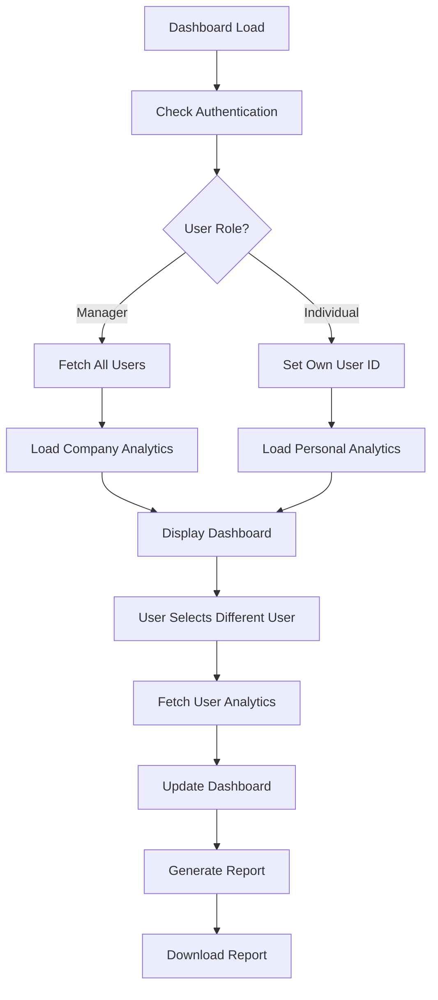

# 📋 Dashboard API Requests & Report Generation Fix

## 🔍 **ALL Dashboard API Requests**

Here's a complete list of all API requests used by the dynamic dashboard:

### 🔐 **1. Authentication Requests**

#### Check Authentication Status

```typescript
GET / auth / isauthenticated;
```

**Used by**: `dashboardService.checkAuthentication()`  
**Purpose**: Verify user authentication and get user data  
**Headers**: `withCredentials: true`  
**Expected Response**:

```json
{
  "success": true,
  "isauthenticated": true,
  "user": {
    "id": "user123",
    "name": "John Doe",
    "email": "john@company.com",
    "role": "SuperAdmin", // SuperAdmin, Admin, CRM Manager, Sales, Support
    "can_generate_report": true,
    "department": "Sales",
    "created_at": "2024-01-01T00:00:00Z"
  }
}
```

### 👥 **2. User Management Requests**

#### Get All Users (Managers Only)

```typescript
GET / dashboard / users / all;
```

**Used by**: `dashboardService.getAllUsers()`  
**Purpose**: Fetch all users for the user selector dropdown  
**Access**: SuperAdmin, Admin, CRM Manager only  
**Headers**: `withCredentials: true`  
**Expected Response**:

```json
{
  "success": true,
  "users": [
    {
      "id": "user123",
      "name": "John Doe",
      "email": "john@company.com",
      "role": "Sales",
      "can_generate_report": true,
      "department": "Sales",
      "created_at": "2024-01-01T00:00:00Z"
    }
    // ... more users
  ]
}
```

### 📊 **3. Analytics Requests**

#### Get Company-Wide Analytics

```typescript
GET / dashboard / analytics / all;
```

**Used by**: `dashboardService.getAllAnalytics()`  
**Purpose**: Fetch analytics for all users combined  
**Access**: SuperAdmin, Admin, CRM Manager only  
**Headers**: `withCredentials: true`

#### Get Personal Analytics

```typescript
GET / dashboard / analytics / me;
```

**Used by**: `dashboardService.getMyAnalytics()`  
**Purpose**: Fetch analytics for current user only  
**Access**: All authenticated users  
**Headers**: `withCredentials: true`

#### Get Specific User Analytics

```typescript
GET / dashboard / analytics / { userId };
```

**Used by**: `dashboardService.getUserAnalytics(userId)`  
**Purpose**: Fetch analytics for a specific user  
**Access**: SuperAdmin, Admin, CRM Manager only  
**Headers**: `withCredentials: true`  
**Parameters**: `{userId}` - ID of the target user

**Expected Analytics Response Structure**:

```json
{
  "success": true,
  "analytics": {
    "totalSales": 150000,
    "totalLeads": 1250,
    "conversionRate": 12.5,
    "totalRevenue": 2500000,
    "monthlyPerformance": [
      {
        "month": "2024-01",
        "sales": 25000,
        "leads": 200,
        "conversion_rate": 12.5,
        "revenue": 400000
      }
      // ... more months
    ],
    "demographicData": {
      "age_groups": { "18-25": 150, "26-35": 350 },
      "locations": { "North America": 600, "Europe": 400 },
      "sources": { "Website": 500, "Social Media": 300 }
    },
    "categoryData": {
      "categories": [
        {
          "name": "Enterprise Software",
          "leads": 400,
          "sales": 50,
          "revenue": 800000
        }
      ]
    },
    "channelData": {
      "channels": [
        {
          "name": "Google Ads",
          "leads": 300,
          "conversion_rate": 15.2,
          "cost_per_lead": 45.5
        }
      ]
    },
    "recentOrders": [
      {
        "id": "order123",
        "customer_name": "ABC Corp",
        "amount": 25000,
        "status": "completed",
        "date": "2024-01-15T10:30:00Z",
        "product": "Enterprise CRM License"
      }
    ],
    "topPerformers": [
      {
        "user_id": "user456",
        "user_name": "Jane Smith",
        "sales": 45000,
        "leads": 180,
        "conversion_rate": 25.0
      }
    ]
  }
}
```

## 📄 **Report Generation Status**

### ✅ **WORKING: Existing Report System**

The dashboard now uses the **existing working report generation** system:

```typescript
POST /reports/new
```

**Used by**: `GenerateReport` component  
**Purpose**: Generate lead reports with filtering options  
**Access**: Users with `can_generate_report` permission  
**Headers**: `withCredentials: true`  
**Request Body**:

```json
{
  "startDate": "2024-01-01",
  "endDate": "2024-01-31",
  "reportType": "source", // source, status, territory, country, all
  "fileType": "xlsx", // xlsx, csv, pdf
  "leadowner": "Bharat Kokatnur", // optional
  "status": "Hot", // optional
  "territory": "T1 - South and West" // optional
}
```

**Response**: Binary file download

### ❌ **NOT IMPLEMENTED: Dynamic Report System**

These endpoints were planned but not implemented in backend:

```typescript
POST / dashboard / generate - report / all; // Company reports
POST / dashboard / generate - report / me; // Personal reports
POST / dashboard / generate - report / { userId }; // User-specific reports
```

## 🔧 **Implementation Changes Made**

### 1. **Restored Working Report Generation**

- ✅ Re-imported `GenerateReport` component
- ✅ Replaced `DynamicReportGenerator` with working `GenerateReport`
- ✅ Maintained role-based access control

### 2. **Dashboard Features Status**

- ✅ **Dynamic User Selection**: Working for managers
- ✅ **Role-based Analytics**: Working with placeholder data
- ✅ **Report Generation**: Working with existing system
- ❌ **Dynamic Analytics Data**: Needs backend implementation

## 🚀 **Next Steps for Backend**

### Priority 1: Implement Analytics Endpoints

```javascript
// 1. GET /dashboard/users/all - Fetch all users for dropdown
// 2. GET /dashboard/analytics/all - Company analytics
// 3. GET /dashboard/analytics/me - Personal analytics
// 4. GET /dashboard/analytics/{userId} - User-specific analytics
```

### Priority 2: (Optional) Enhanced Report System

```javascript
// 1. POST /dashboard/generate-report/all - Company reports
// 2. POST /dashboard/generate-report/me - Personal reports
// 3. POST /dashboard/generate-report/{userId} - User reports
```

## 📊 **Current Working Features**

### ✅ **Fully Functional**

1. **Authentication Check** - Works with existing backend
2. **Role-based UI** - Dynamic interface based on user role
3. **User Selector** - Shows for managers only
4. **Report Generation** - Uses existing working system
5. **Loading States** - Professional UX feedback
6. **Error Handling** - Graceful degradation

### ⚠️ **Needs Backend Implementation**

1. **User List Fetching** - `/users/all` endpoint
2. **Dynamic Analytics Data** - Analytics endpoints
3. **Real-time Data Updates** - Based on user selection

## 🔍 **API Request Flow**



## 📝 **Testing Checklist**

### Authentication & User Management

- [ ] `/auth/isauthenticated` returns user data
- [ ] Role-based UI shows correctly
- [ ] Managers see user selector
- [ ] Individual contributors see personal view only

### Analytics (When Implemented)

- [ ] `/dashboard/users/all` returns user list for managers
- [ ] `/dashboard/analytics/all` works for managers
- [ ] `/dashboard/analytics/me` works for all users
- [ ] `/dashboard/analytics/{userId}` works for managers

### Report Generation

- [ ] Report button shows for authorized users
- [ ] Reports download successfully
- [ ] Different file formats work (Excel, CSV, PDF)
- [ ] Date range validation works

## 🎯 **Summary**

The dashboard is now **working with existing backend APIs** and provides:

1. ✅ **Dynamic role-based interface**
2. ✅ **Working report generation**
3. ✅ **Professional user experience**
4. ⚠️ **Ready for analytics backend implementation**

The report generation issue has been **fixed** by using your existing working `/reports/new` endpoint instead of the unimplemented dynamic report endpoints.
